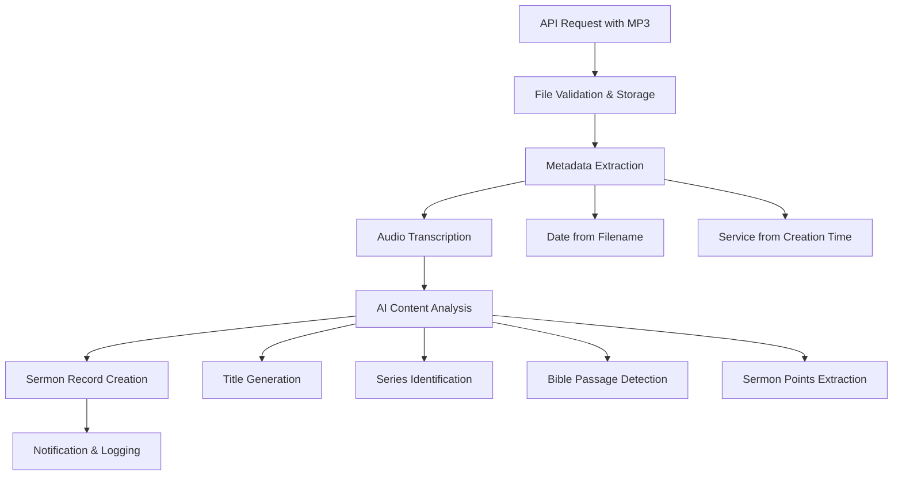

# Design Document

## Overview

The automated sermon processing feature extends the existing Laravel-based sermon management system by adding AI-powered processing capabilities. The system will accept MP3 files via a dedicated API endpoint, extract metadata from filenames and file properties, transcribe audio content using AI services, and generate structured sermon information including titles, series identification, Bible passage references, and sermon point headings.

The design integrates seamlessly with the existing Sermon model and database structure, maintaining full compatibility with current sermon display and management functionality while adding new automated processing capabilities.

## Architecture

### High-Level Flow



### Service Layer Architecture

The system follows Laravel's service-oriented architecture with dedicated services for each major processing step:

- **AutomatedSermonController**: Handles API requests and orchestrates processing
- **SermonProcessingService**: Main orchestration service
- **AudioTranscriptionService**: Handles AI transcription
- **SermonAnalysisService**: Performs AI content analysis
- **MetadataExtractionService**: Extracts metadata from files
- **SermonStorageService**: Manages file storage and database operations

## Components and Interfaces

### API Endpoint

**Route**: `POST /api/sermons/automated`

**Request Format**:
```php
Content-Type: multipart/form-data
file: MP3 audio file (required)
```

**Response Format**:
```json
{
    "success": true,
    "message": "Sermon processing initiated",
    "processing_id": "uuid-string",
    "status_url": "/api/sermons/processing/{processing_id}/status"
}
```

### Core Services

#### SermonProcessingService

```php
class SermonProcessingService
{
    public function processSermon(UploadedFile $file): ProcessingResult
    public function getProcessingStatus(string $processingId): ProcessingStatus
    private function extractMetadata(UploadedFile $file): SermonMetadata
    private function transcribeAudio(string $filePath): string
    private function analyzeContent(string $transcript): SermonAnalysis
    private function createSermonRecord(SermonData $data): Sermon
}
```

#### AudioTranscriptionService

```php
class AudioTranscriptionService
{
    public function transcribe(string $audioFilePath): TranscriptionResult
    private function callTranscriptionAPI(string $filePath): string
    private function validateTranscript(string $transcript): bool
    private function formatAsMarkdown(string $transcript): string
}
```

#### SermonAnalysisService

```php
class SermonAnalysisService
{
    public function analyzeSermon(string $transcript, array $existingSeries): SermonAnalysis
    private function generateTitle(string $transcript): string
    private function identifySeries(string $transcript, array $existingSeries): ?string
    private function extractBiblePassage(string $transcript): ?string
    private function extractSermonPoints(string $transcript): array
    private function validateTitleLength(string $title): string
}
```

### Data Transfer Objects

#### SermonMetadata
```php
class SermonMetadata
{
    public readonly Carbon $date;
    public readonly SermonService $service;
    public readonly string $filename;
    public readonly string $originalName;
}
```

#### SermonAnalysis
```php
class SermonAnalysis
{
    public readonly string $title;
    public readonly ?string $series;
    public readonly ?string $reference;
    public readonly array $points;
    public readonly string $transcript;
}
```

## Data Models

### Database Schema Extensions

The existing `sermons` table structure supports all required fields:

- `date`: Extracted from filename
- `service`: Determined from file creation time
- `filename`: Stored file path
- `title`: AI-generated (max 12 words)
- `series`: Matched from existing series or null
- `reference`: AI-extracted Bible passage
- `preacher`: Default 'Mark Drury'
- `points`: JSON array of sermon headings
- `slug`: Generated from title

### New Processing Tracking Table

```sql
CREATE TABLE sermon_processing_logs (
    id BIGINT UNSIGNED PRIMARY KEY AUTO_INCREMENT,
    processing_id VARCHAR(36) UNIQUE NOT NULL,
    original_filename VARCHAR(255) NOT NULL,
    status ENUM('pending', 'processing', 'completed', 'failed') NOT NULL,
    current_step VARCHAR(50),
    error_message TEXT NULL,
    sermon_id BIGINT UNSIGNED NULL,
    created_at TIMESTAMP DEFAULT CURRENT_TIMESTAMP,
    updated_at TIMESTAMP DEFAULT CURRENT_TIMESTAMP ON UPDATE CURRENT_TIMESTAMP,
    FOREIGN KEY (sermon_id) REFERENCES sermons(id) ON DELETE SET NULL
);
```

### Transcript Storage

Transcripts will be stored as separate files in the storage system:

- **Location**: `storage/app/transcripts/{sermon_id}.md`
- **Format**: Markdown with auto-generated headings
- **Access**: Via new `transcript_path` field or computed accessor
- **Timing**: Sermon record created first with 'processing' status to provide stable sermon_id for file storage

## Error Handling

### Processing Pipeline Error Handling

Each processing step implements comprehensive error handling:

1. **File Validation Errors**: Invalid format, corrupted files, size limits
2. **Metadata Extraction Errors**: Unparseable filenames, missing creation time
3. **Transcription Errors**: API failures, poor audio quality, timeout issues
4. **AI Analysis Errors**: API rate limits, content analysis failures
5. **Database Errors**: Constraint violations, connection issues

### Error Recovery Strategies

- **Graceful Degradation**: Use fallback values when AI processing fails
- **Retry Logic**: Automatic retry for transient API failures
- **Manual Review Queue**: Flag failed items for administrator review
- **Detailed Logging**: Comprehensive error tracking for troubleshooting

### Error Response Format

```json
{
    "success": false,
    "error": {
        "code": "TRANSCRIPTION_FAILED",
        "message": "Audio transcription service unavailable",
        "details": "API returned 503 status",
        "retry_after": 300
    },
    "processing_id": "uuid-string"
}
```

## Testing Strategy

### Unit Testing

- **Service Layer Tests**: Mock external API calls, test business logic
- **Metadata Extraction Tests**: Various filename formats and edge cases
- **Content Analysis Tests**: Different transcript formats and content types
- **Error Handling Tests**: Simulate various failure scenarios

### Integration Testing

- **End-to-End API Tests**: Full processing pipeline with sample files
- **Database Integration Tests**: Verify correct sermon record creation
- **File Storage Tests**: Ensure proper file handling and cleanup
- **External Service Integration**: Test with actual AI service APIs

### Test Data

- **Sample Audio Files**: Various formats, lengths, and quality levels
- **Mock Transcripts**: Different sermon styles and content structures
- **Edge Case Files**: Unusual filenames, corrupted files, empty content

### Performance Testing

- **Processing Time Benchmarks**: Measure typical processing duration
- **Concurrent Processing Tests**: Multiple simultaneous uploads
- **Large File Handling**: Test with extended sermon recordings
- **API Rate Limit Testing**: Verify proper handling of service limits

## External Service Integration

### AI Transcription Service

**Primary Option**: OpenAI Whisper API
- **Endpoint**: `https://api.openai.com/v1/audio/transcriptions`
- **Authentication**: API key via environment variable
- **Rate Limits**: Handle 429 responses with exponential backoff
- **File Size Limits**: 25MB maximum, implement chunking if needed

**Fallback Option**: Local Whisper installation
- **Use Case**: When API is unavailable or for cost optimization
- **Implementation**: Command-line interface to local Whisper binary

### AI Content Analysis Service

**Primary Option**: OpenAI GPT API
- **Model**: GPT-4 or GPT-3.5-turbo for content analysis
- **Prompts**: Structured prompts for title, series, and passage extraction
- **Response Format**: JSON-structured responses for reliable parsing

### Recommended Packages

The following packages will enhance the implementation:

- **openai-php/laravel**: Official Laravel wrapper for OpenAI API integration
- **spatie/laravel-data**: Powerful DTOs with validation and casting capabilities
- **james-heinrich/getid3**: Comprehensive audio file metadata extraction (already available)

### Configuration

```php
// config/sermon-processing.php
return [
    'transcription' => [
        'service' => env('TRANSCRIPTION_SERVICE', 'openai'),
        'openai_api_key' => env('OPENAI_API_KEY'),
        'max_file_size' => 25 * 1024 * 1024, // 25MB
        'timeout' => 300, // 5 minutes
    ],
    'analysis' => [
        'service' => env('ANALYSIS_SERVICE', 'openai'),
        'model' => env('OPENAI_MODEL', 'gpt-3.5-turbo'),
        'max_title_words' => 12,
        'timeout' => 60,
    ],
    'processing' => [
        'queue' => env('SERMON_PROCESSING_QUEUE', 'default'),
        'retry_attempts' => 3,
        'retry_delay' => 60, // seconds
    ],
];
```

## Queue Integration

### Background Processing

All sermon processing will be handled via Laravel's queue system using job chaining for better modularity and error handling:

```php
// Job Chain Structure
Bus::chain([
    new CreateSermonRecord($processingId, $metadata),
    new TranscribeAudio($sermonId, $filePath),
    new AnalyzeTranscript($sermonId),
    new GenerateSermonHeadings($sermonId),
    new UpdateSermonRecord($sermonId),
    new SendCompletionNotification($sermonId),
])->catch(function (Throwable $e) {
    // Handle chain failure
    SermonProcessingLog::where('processing_id', $processingId)
        ->update(['status' => 'failed', 'error_message' => $e->getMessage()]);
})->dispatch();
```

**Individual Job Classes:**
- `CreateSermonRecord`: Creates initial sermon record with 'processing' status
- `TranscribeAudio`: Handles AI transcription using OpenAI Whisper
- `AnalyzeTranscript`: Performs content analysis for title, series, and Bible passage
- `GenerateSermonHeadings`: Extracts sermon points and creates headings
- `UpdateSermonRecord`: Finalizes sermon record with all processed data
- `SendCompletionNotification`: Notifies administrators of completion

### Queue Configuration

- **Driver**: Redis (recommended) or database
- **Retry Logic**: 3 attempts with exponential backoff
- **Timeout**: 30 minutes for complete processing
- **Failed Job Handling**: Store in failed_jobs table for manual review

## Security Considerations

### File Upload Security

- **File Type Validation**: Strict MIME type checking for audio files
- **File Size Limits**: Maximum 100MB per upload
- **Virus Scanning**: Integration with ClamAV or similar (optional)
- **Secure Storage**: Files stored outside web root

### API Security

- **Authentication**: API key or token-based authentication
- **Rate Limiting**: Prevent abuse with request throttling
- **Input Validation**: Comprehensive validation of all inputs
- **CORS Configuration**: Restrict cross-origin requests appropriately

### Data Privacy

- **Transcript Storage**: Secure storage with appropriate access controls
- **API Key Management**: Secure storage of external service credentials
- **Audit Logging**: Track all processing activities for compliance
- **Data Retention**: Configurable retention policies for processing logs

## Health Monitoring

### Laravel 12 Health Checks

Leverage Laravel 12's built-in health check features for monitoring:

```php
// In AppServiceProvider or dedicated HealthServiceProvider
Health::checks([
    QueueHealthCheck::new()->name('sermon-processing-queue'),
    DatabaseHealthCheck::new()->name('database'),
    OpenAIHealthCheck::new()->name('openai-api'),
]);
```

**Custom Health Checks:**
- **Queue Worker Health**: Monitor sermon processing queue status
- **Database Connectivity**: Verify database connection and performance
- **OpenAI API Health**: Check API endpoint availability and response times
- **Storage Health**: Verify file storage accessibility

**Monitoring Endpoint**: `/up` provides standardized health status for automated monitoring services