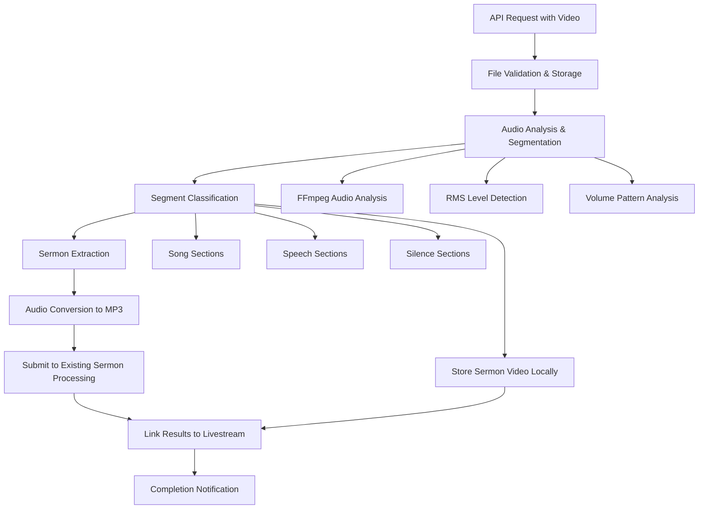

# Design Document - As Implemented

## Overview

The livestream video processing feature extends the existing automated sermon processing system to handle full livestream recordings. The system automatically segments video files using audio analysis techniques (based on the existing ClipLongestQuietSection.py approach), identifies sermon portions, extracts both audio and video, and feeds the audio into the existing automated sermon processing pipeline while storing the video locally.

This implementation builds upon the existing Laravel-based sermon processing infrastructure with video processing capabilities through FFmpeg integration and intelligent audio analysis for automatic segmentation.

## Architecture

### High-Level Flow



### Service Layer Architecture

The system extends the existing service architecture with focused services:

- **LivestreamProcessingController**: Handles API requests for video uploads
- **LivestreamProcessingService**: Orchestrates the workflow by dispatching job chains
- **VideoSegmentationService**: Contains business logic for analyzing FFmpeg output and identifying segments
- **VideoStorageService**: Manages video file storage using Laravel's Storage facade
- **SermonMetadataIntegrationService**: Handles video-sermon linking and metadata integration
- **SermonVideoDisplayService**: Provides administrative interface support for video display
- **LivestreamProcessingLogger**: Comprehensive logging and reporting functionality
- **LivestreamErrorHandler**: Advanced error handling and recovery strategies

## Components and Interfaces

### API Endpoints

#### Primary Upload Endpoint
**Route**: `POST /api/livestreams/process`

**Request Format**:
```php
Content-Type: multipart/form-data
video: Video file (required) - MP4, MOV, AVI, MKV, WEBM
options: JSON object (optional) - Processing preferences
options.rms_threshold: Numeric between -60 and 0
options.min_section_duration: Numeric minimum 10 seconds
options.min_sermon_duration: Numeric minimum 60 seconds
```

**Response Format**:
```json
{
    "success": true,
    "message": "Livestream processing initiated",
    "processing_id": "uuid-string",
    "status_url": "/api/livestreams/processing/{processing_id}/status",
    "estimated_completion": "2024-01-15T10:30:00Z"
}
```

#### Status Monitoring Endpoint
**Route**: `GET /api/livestreams/processing/{processingId}/status`

**Response Format**:
```json
{
    "processing_id": "uuid-string",
    "status": "segmenting",
    "current_step": "audio_analysis",
    "progress_percentage": 45,
    "segments_identified": 5,
    "sermon_processing_id": "uuid-string",
    "sermon_video_path": "/storage/sermons/2024-01-15/sermon_video.mp4",
    "segments": [
        {
            "index": 1,
            "start_time": 0.0,
            "end_time": 180.5,
            "classification": "song",
            "is_sermon": false
        },
        {
            "index": 2,
            "start_time": 180.5,
            "end_time": 2100.0,
            "classification": "speech",
            "is_sermon": true
        }
    ]
}
```

#### Additional Endpoints
- **GET** `/api/livestreams/processing/{processingId}/result` - Full processing result with comprehensive data
- **POST** `/api/livestreams/processing/{processingId}/retry` - Retry failed processing
- **POST** `/api/livestreams/processing/{processingId}/cancel` - Cancel ongoing processing
- **GET** `/api/livestreams/processing/summary` - Processing statistics summary

### Core Services

#### LivestreamProcessingService

```php
class LivestreamProcessingService
{
    public function startProcessing(UploadedFile $videoFile): ProcessingResult
    public function getProcessingStatus(string $processingId): LivestreamProcessingStatus
    public function getProcessingResult(string $processingId): LivestreamProcessingResult
    public function retryProcessing(string $processingId): LivestreamProcessingResult
    public function cancelProcessing(string $processingId): bool
    public function getProcessingSummary(): array
    private function dispatchProcessingJobs(LivestreamProcessingLog $processingLog): void
    private function handleProcessingFailure(string $processingId, Throwable $e): void
    private function buildProcessingResult(LivestreamProcessingLog $processingLog): LivestreamProcessingResult
}
```

#### VideoSegmentationService

```php
class VideoSegmentationService
{
    public function generateRmsLog(string $videoPath): string
    public function analyzeSegments(string $rmsLogPath): array
    public function getVideoMetadata(string $videoPath): array
    public function validateVideoFile(string $videoPath): bool
    private function parseRmsLog(string $logContent): array
    private function parseAudioSections(string $logContent, float $threshold = null, float $minSectionDuration = null): array
    private function combineLoudAndQuietSections(array $loudSections, float $totalDuration): array
    private function identifySermonCandidate(array $segments): array
    private function finalizeSegment(array $segmentData, int $order): ?LivestreamSegment
    private function calculateVariance(array $values): float
}
```

#### VideoStorageService

```php
class VideoStorageService
{
    public function storeUploadedVideo(UploadedFile $file): array
    public function extractVideoSegmentWithOriginalQuality(string $inputPath, float $startTime, float $endTime): string
    public function extractVideoSegment(string $inputVideoPath, LivestreamSegment $segment, string $outputFilename = null): string
    public function extractAudioFromSegment(string $inputVideoPath, LivestreamSegment $segment, string $outputFilename = null): string
    public function moveToSermonStorage(string $tempVideoPath, string $sermonSlug): array
    public function cleanupTemporaryFiles(string $processingId): void
    public function cleanupExpiredFiles(): int
    public function getStorageStats(): array
    public function validateStorageSpace(int $requiredBytes): bool
    public function getVideoUrl(string $videoPath): string
    public function getAudioUrl(string $audioPath): string
    public function videoExists(string $videoPath): bool
    public function audioExists(string $audioPath): bool
}
```

#### SermonMetadataIntegrationService

```php
class SermonMetadataIntegrationService
{
    public function linkVideoToSermon(string $processingId, int $sermonId): void
    public function storeVideoWithMetadata(string $processingId, array $sermonMetadata): string
    public function getVideoInfo(int $sermonId): array
    public function getVideoPreviewData(int $sermonId): array
    public function cleanupTemporaryVideoFiles(string $processingId): void
    public function validateVideoFile(string $videoPath): bool
    private function getSermonVideoPath(string $processingId): ?string
    private function extractSermonVideo(string $processingId): ?string
    private function organizeVideoFile(string $videoPath, array $metadata): string
    private function formatFileSize(int $bytes): string
}
```

#### SermonVideoDisplayService

```php
class SermonVideoDisplayService
{
    public function getSermonWithVideo(int $sermonId): array
    public function getVideoPreviewData(int $sermonId): array
    public function getVideoUrl(string $videoPath): string
    public function getSermonsBySourceType(string $sourceType = null): array
    public function getLivestreamSourceIndicator(Sermon $sermon): array
    private function getVideoStoragePath(string $videoPath): string
    private function getVideoDuration(string $videoPath): ?float
    private function getVideoFileSize(string $videoPath): ?int
}
```

#### LivestreamProcessingLogger

```php
class LivestreamProcessingLogger
{
    public function logProcessingStep(string $processingId, string $step, array $context = []): void
    public function logError(string $processingId, string $step, Throwable $exception): void
    public function logWarning(string $processingId, string $step, string $message, array $context = []): void
    public function logPerformanceMetrics(string $processingId, string $step, float $executionTime, array $metrics = []): void
    public function generateProcessingReport(string $processingId): ProcessingReport
    public function logProcessingCompletion(string $processingId, bool $success, array $summary = []): void
    public function getRecentProcessingActivity(int $hours = 24): array
    private function getProcessingLogs(string $processingId): Collection
    private function parseLogLine(string $line): ?array
    private function generateSegmentSummary($segments): array
    private function extractPerformanceMetrics(Collection $logs): array
}
```

#### LivestreamErrorHandler

```php
class LivestreamErrorHandler
{
    public function handleProcessingFailure(string $processingId, Throwable $exception, string $step = 'unknown'): void
    public function handlePartialFailure(string $processingId, string $step, string $message, array $context = []): void
    public function shouldRetry(Throwable $exception, int $attemptNumber = 1): bool
    public function getRetryDelay(int $attemptNumber): int
    public function handleSegmentationFailure(string $processingId, string $reason, array $segments = []): void
    public function handleVideoExtractionFailure(string $processingId, Throwable $exception): void
    public function handleStorageError(string $processingId, Throwable $exception, string $operation): bool
    public function validateFileFormat(string $filePath): array
    public function checkSystemRequirements(): array
    public function gracefulDegradation(string $processingId, string $reason, callable $fallbackAction = null): void
}
```

### Data Transfer Objects

#### LivestreamSegment
```php
class LivestreamSegment extends Data
{
    public function __construct(
        public float $startTime,
        public float $endTime,
        public float $duration,
        public string $classification, // 'song', 'speech', 'silence'
        public float $avgRms,
        public float $peakRms,
        public bool $isSermonCandidate = false,
        public int $segmentOrder = 0,
        public ?array $metadata = null,
    ) {}

    public function getDurationInMinutes(): float
    public function getStartTimeFormatted(): string
    public function getEndTimeFormatted(): string
    public function getDurationFormatted(): string
    public function isSpeech(): bool
    public function isSong(): bool
    public function isSilence(): bool
}
```

#### LivestreamProcessingResult
```php
class LivestreamProcessingResult extends Data
{
    public function __construct(
        public string $processingId,
        public string $status, // 'pending', 'processing', 'segmentation_complete', 'extraction_complete', 'sermon_submitted', 'completed', 'failed'
        public string $originalFilename,
        public int $fileSize,
        public string $fileFormat,
        public ?float $duration = null,
        public ?float $sermonStartTime = null,
        public ?float $sermonEndTime = null,
        public ?int $sermonId = null,
        public ?string $errorMessage = null,
        public ?array $processingMetadata = null,
        public ?string $startedAt = null,
        public ?string $completedAt = null,
        /** @var LivestreamSegment[] */
        public array $segments = [],
        public ?array $segmentsSummary = null,
    ) {}

    public function isCompleted(): bool
    public function isFailed(): bool
    public function isProcessing(): bool
    public function isPending(): bool
    public function hasSermon(): bool
    public function hasSegments(): bool
    public function getFileSizeFormatted(): string
    public function getDurationFormatted(): ?string
    public function getSermonDurationFormatted(): ?string
    public function getProgressPercentage(): int
    public function getStatusDisplayName(): string
}
```

#### LivestreamProcessingStatus
```php
class LivestreamProcessingStatus extends Data
{
    public function __construct(
        public string $processingId,
        public string $status,
        public string $currentStep,
        public int $progressPercentage,
        public ?string $errorMessage = null,
        public array $stepDetails = [],
        public array $processingStats = [],
    ) {}
}
```

## Data Models

### Database Schema Extensions

#### Livestream Processing Logs Table
```sql
CREATE TABLE livestream_processing_logs (
    id BIGINT UNSIGNED PRIMARY KEY AUTO_INCREMENT,
    processing_id VARCHAR(36) UNIQUE NOT NULL,
    original_filename VARCHAR(255) NOT NULL,
    original_file_path VARCHAR(500) NOT NULL,
    file_size BIGINT UNSIGNED NOT NULL,
    file_format VARCHAR(10) NULL,
    duration FLOAT NULL,
    status ENUM('pending', 'processing', 'segmenting', 'extraction_complete', 'sermon_submitted', 'completed', 'failed') DEFAULT 'pending',
    error_message TEXT NULL,
    rms_log_path VARCHAR(500) NULL,
    sermon_audio_path VARCHAR(500) NULL,
    sermon_video_path VARCHAR(500) NULL,
    sermon_start_time FLOAT NULL,
    sermon_end_time FLOAT NULL,
    sermon_processing_id VARCHAR(36) NULL,
    sermon_id INT UNSIGNED NULL,
    processing_metadata JSON NULL,
    started_at TIMESTAMP NULL,
    completed_at TIMESTAMP NULL,
    created_at TIMESTAMP DEFAULT CURRENT_TIMESTAMP,
    updated_at TIMESTAMP DEFAULT CURRENT_TIMESTAMP ON UPDATE CURRENT_TIMESTAMP,
    FOREIGN KEY (sermon_id) REFERENCES sermons(id) ON DELETE SET NULL,
    INDEX idx_status (status),
    INDEX idx_processing_id (processing_id)
);
```

#### Livestream Segments Table
```sql
CREATE TABLE livestream_segments (
    id BIGINT UNSIGNED PRIMARY KEY AUTO_INCREMENT,
    processing_id VARCHAR(36) NOT NULL,
    processing_log_id BIGINT UNSIGNED NOT NULL,
    segment_index TINYINT UNSIGNED NOT NULL,
    start_time DECIMAL(10,3) NOT NULL,
    end_time DECIMAL(10,3) NOT NULL,
    duration DECIMAL(10,3) NOT NULL,
    classification ENUM('song', 'speech', 'silence') NOT NULL,
    is_sermon_segment BOOLEAN DEFAULT FALSE,
    is_sermon_candidate BOOLEAN DEFAULT FALSE,
    avg_rms FLOAT NULL,
    peak_rms FLOAT NULL,
    segment_order INT DEFAULT 0,
    metadata JSON NULL,
    created_at TIMESTAMP DEFAULT CURRENT_TIMESTAMP,
    updated_at TIMESTAMP DEFAULT CURRENT_TIMESTAMP ON UPDATE CURRENT_TIMESTAMP,
    FOREIGN KEY (processing_id) REFERENCES livestream_processing_logs(processing_id) ON DELETE CASCADE,
    FOREIGN KEY (processing_log_id) REFERENCES livestream_processing_logs(id) ON DELETE CASCADE,
    INDEX idx_processing_id (processing_id),
    INDEX idx_processing_log_id (processing_log_id),
    INDEX idx_is_sermon_segment (is_sermon_segment),
    INDEX idx_is_sermon_candidate (is_sermon_candidate)
);
```

#### Sermon Extensions Table
```sql
ALTER TABLE sermons ADD COLUMN livestream_processing_id VARCHAR(36) NULL AFTER id;
ALTER TABLE sermons ADD COLUMN video_file_path VARCHAR(500) NULL AFTER filename;
ALTER TABLE sermons ADD COLUMN source_type ENUM('manual', 'audio_upload', 'livestream') DEFAULT 'manual' AFTER video_file_path;
ALTER TABLE sermons ADD COLUMN segment_start_time DECIMAL(10,3) NULL AFTER source_type;
ALTER TABLE sermons ADD COLUMN segment_end_time DECIMAL(10,3) NULL AFTER segment_start_time;

ALTER TABLE sermons ADD INDEX idx_livestream_processing (livestream_processing_id);
ALTER TABLE sermons ADD INDEX idx_source_type (source_type);
```

### File Storage Structure

```
storage/app/livestream/temp/
├── {uuid-filename}.mp4          # Original uploaded video (temporary)

storage/app/temp/
├── rms_{uuid}.log               # FFmpeg RMS analysis output (temporary)
├── {uuid}_sermon.mp4            # Extracted sermon video (temporary)
└── {uuid}_sermon.mp3            # Extracted sermon audio (temporary)

storage/app/sermons/videos/
├── {filename}.mp4               # Processed sermon videos

storage/app/sermons/audio/
├── {filename}.mp3               # Processed sermon audio

storage/app/sermons/{sermon_id}/
├── video.mp4                    # Final sermon video
├── metadata.json                # Sermon metadata including livestream source
```

## Audio Analysis Implementation

### FFmpeg Integration

The system uses FFmpeg for audio analysis, closely following the logic from ClipLongestQuietSection.py:

#### RMS Level Analysis with Accurate Timing
```php
public function generateRmsLog(string $videoPath): string
{
    $rmsLogPath = 'temp/rms_' . Str::uuid() . '.log';
    $fullRmsLogPath = Storage::disk($this->tempDisk)->path($rmsLogPath);

    // Include pts_time for accurate timestamps instead of calculating frame duration
    $command = [
        config('livestream-processing.ffmpeg_path'),
        '-i', $videoPath,
        '-af', "astats=metadata=1:reset=1,ametadata=print:key=lavfi.astats.Overall.RMS_level:key=frame.pts_time:file={$fullRmsLogPath}",
        '-f', 'null',
        '-'
    ];
    
    $process = new \Symfony\Component\Process\Process($command);
    $process->setTimeout(7200); // 2 hour timeout for large files
    $process->run();
    
    if (!$process->isSuccessful()) {
        throw new \Symfony\Component\Process\Exception\ProcessFailedException($process);
    }
    
    return $rmsLogPath;
}
```

#### Segment Identification with Accurate Timing
```php
private function parseAudioSections(string $logContent, float $threshold = null, float $minSectionDuration = null): array
{
    $threshold = $threshold ?? $this->rmsThreshold;
    $minSectionDuration = $minSectionDuration ?? $this->minSectionDuration;
    
    $lines = explode("\n", trim($logContent));
    $sections = [];
    $currentSection = null;
    
    foreach ($lines as $line) {
        // Parse both RMS level and accurate timestamp from FFmpeg output
        if (preg_match('/frame\.pts_time=(\d+\.\d+).*lavfi\.astats\.Overall\.RMS_level=(-?\d+\.\d+)/', $line, $matches)) {
            $time = (float) $matches[1]; // Use actual pts_time instead of calculated duration
            $rmsLevel = (float) $matches[2];
            
            if ($rmsLevel > $threshold) {
                // Start a new loud section if none is active
                if ($currentSection === null) {
                    $currentSection = ['start' => $time, 'end' => null];
                }
            } else {
                // End the current loud section if active
                if ($currentSection !== null) {
                    $currentSection['end'] = $time;
                    // Only add the section if it meets the minimum duration
                    if (($currentSection['end'] - $currentSection['start']) >= $minSectionDuration) {
                        $sections[] = $currentSection;
                    }
                    $currentSection = null;
                }
            }
        }
    }
    
    // Close any open section at end of file
    if ($currentSection !== null && isset($time)) {
        $currentSection['end'] = $time;
        if (($currentSection['end'] - $currentSection['start']) >= $minSectionDuration) {
            $sections[] = $currentSection;
        }
    }
    
    return $sections;
}

private function combineLoudAndQuietSections(array $loudSections, float $totalDuration): array
{
    $combinedSections = [];
    $previousEnd = 0.0;
    $segmentOrder = 0;
    
    foreach ($loudSections as $section) {
        $start = $section['start'];
        $end = $section['end'];
        
        // Add quiet section before the current loud section
        if ($start > $previousEnd) {
            $combinedSections[] = new LivestreamSegment(
                startTime: $previousEnd,
                endTime: $start,
                duration: $start - $previousEnd,
                classification: 'speech',
                avgRms: -40.0, // Typical speech RMS level
                peakRms: -30.0,
                segmentOrder: $segmentOrder++
            );
        }
        
        // Add the current loud section
        $combinedSections[] = new LivestreamSegment(
            startTime: $start,
            endTime: $end,
            duration: $end - $start,
            classification: 'song',
            avgRms: -20.0, // Typical song RMS level
            peakRms: -10.0,
            segmentOrder: $segmentOrder++
        );
        
        $previousEnd = $end;
    }
    
    // Add the final quiet section if it exists
    if ($previousEnd < $totalDuration) {
        $combinedSections[] = new LivestreamSegment(
            startTime: $previousEnd,
            endTime: $totalDuration,
            duration: $totalDuration - $previousEnd,
            classification: 'speech',
            avgRms: -40.0,
            peakRms: -30.0,
            segmentOrder: $segmentOrder
        );
    }
    
    return $combinedSections;
}
```

### Configuration Options

```php
// config/livestream-processing.php
return [
    'rms_threshold' => env('LIVESTREAM_RMS_THRESHOLD', -30.0), // Sections above this are "song", below are "speech"
    'min_section_duration' => env('LIVESTREAM_MIN_SECTION_DURATION', 60.0),
    'min_sermon_duration' => env('LIVESTREAM_MIN_SERMON_DURATION', 300.0), // 5 minutes minimum for sermon
    'ffmpeg_path' => env('FFMPEG_PATH', '/usr/bin/ffmpeg'),
    'ffprobe_path' => env('FFPROBE_PATH', '/usr/bin/ffprobe'),
    'max_file_size' => env('LIVESTREAM_MAX_FILE_SIZE', 2147483648), // 2GB
    'supported_formats' => ['mp4', 'mov', 'avi', 'mkv'],
    'storage_disk' => env('LIVESTREAM_STORAGE_DISK', 'local'),
    'sermon_disk' => env('LIVESTREAM_SERMON_DISK', 'local'),
    'temp_disk' => env('LIVESTREAM_TEMP_DISK', 'local'),
    'processing_timeout' => env('LIVESTREAM_PROCESSING_TIMEOUT', 7200), // 2 hours
    'max_concurrent_jobs' => env('LIVESTREAM_MAX_CONCURRENT_JOBS', 2),
    'retry_attempts' => env('LIVESTREAM_RETRY_ATTEMPTS', 3),
    'retry_delay' => env('LIVESTREAM_RETRY_DELAY', 60),
    'admin_email' => env('LIVESTREAM_ADMIN_EMAIL', config('mail.from.address')),
    'notify_on_success' => env('LIVESTREAM_NOTIFY_SUCCESS', false),
    'notify_on_failure' => env('LIVESTREAM_NOTIFY_FAILURE', true),
    'temp_file_retention_hours' => env('LIVESTREAM_TEMP_RETENTION_HOURS', 24),
    'failed_processing_retention_days' => env('LIVESTREAM_FAILED_RETENTION_DAYS', 7),
    'auto_cleanup_enabled' => env('LIVESTREAM_AUTO_CLEANUP', true),
    'audio_sample_rate' => env('LIVESTREAM_AUDIO_SAMPLE_RATE', 44100),
    'video_quality_preset' => env('LIVESTREAM_VIDEO_PRESET', 'medium'),
    'preserve_original_quality' => env('LIVESTREAM_PRESERVE_QUALITY', true),
    'detailed_logging' => env('LIVESTREAM_DETAILED_LOGGING', true),
    'log_ffmpeg_output' => env('LIVESTREAM_LOG_FFMPEG', false),
    'performance_monitoring' => env('LIVESTREAM_PERFORMANCE_MONITORING', true),
];
```

### Required Composer Packages

```json
{
    "require": {
        "php-ffmpeg/php-ffmpeg": "^1.0",
        "spatie/laravel-data": "^3.0",
        "spatie/laravel-health": "^1.0"
    }
}
```

## Queue Integration

### Job Chain Structure

```php
// Job chain for resilient processing
Bus::chain([
    new GenerateRmsLog($processingLog),
    new AnalyzeSegments($processingLog),
    new ExtractSermon($processingLog),
    new SubmitToProcessing($processingLog),
    new CleanupTemporaryFiles($processingLog),
])->catch(function (Throwable $e) use ($processingId) {
    $this->handleProcessingFailure($processingId, $e);
})->dispatch();
```

### Job Chain Classes

- **GenerateRmsLog**: 
  - Validates video file format and size
  - Generates RMS log using FFmpeg with accurate pts_time timestamps
  - Updates status to 'processing'

- **AnalyzeSegments**: 
  - Parses RMS log following ClipLongestQuietSection.py logic
  - Identifies segments and stores in database
  - Finds longest speech section as sermon candidate
  - Updates status to 'segmentation_complete'

- **ExtractSermon**: 
  - Extracts sermon video segment preserving original quality using php-ffmpeg
  - Converts audio to MP3 for sermon processing
  - Uses Laravel Storage facade for file operations
  - Updates status to 'extraction_complete'

- **SubmitToProcessing**: 
  - Submits sermon audio to existing processing pipeline
  - Stores video with sermon metadata using SermonMetadataIntegrationService
  - Links video to sermon record
  - Updates status to 'completed' or 'failed'

- **CleanupTemporaryFiles**: 
  - Cleans up temporary files and processing directories
  - Ensures reliable cleanup after both successful and failed processing
  - Removes RMS logs, extracted audio, and temporary video segments

## Sermon Processing Integration

### Metadata Extraction and Storage

The system integrates with the existing automated sermon processing pipeline to extract and utilize metadata for video storage:

#### Sermon Metadata Integration

```php
class SermonMetadataIntegrationService
{
    public function linkVideoToSermon(string $processingId, int $sermonId): void
    {
        $processing = LivestreamProcessingLog::where('processing_id', $processingId)->firstOrFail();
        $sermon = Sermon::findOrFail($sermonId);
        
        // Get the sermon segment information
        $sermonSegment = $processing->segments()
            ->where('is_sermon_segment', true)
            ->first();
        
        // Update sermon record with livestream information
        $sermon->update([
            'livestream_processing_id' => $processingId,
            'video_file_path' => $this->getSermonVideoPath($processingId),
            'source_type' => 'livestream',
            'segment_start_time' => $sermonSegment->start_time,
            'segment_end_time' => $sermonSegment->end_time,
            'livestream_metadata' => [
                'original_filename' => $processing->original_filename,
                'processing_date' => $processing->created_at->toISOString(),
                'total_segments' => $processing->segments()->count(),
                'segment_index' => $sermonSegment->segment_index,
            ]
        ]);
        
        // Update processing log with sermon link
        $processing->update(['sermon_id' => $sermonId]);
    }
    
    public function storeVideoWithMetadata(string $processingId, array $sermonMetadata): string
    {
        $sermonId = $sermonMetadata['sermon_id'];
        $videoPath = $this->extractSermonVideo($processingId);
        
        // Use metadata from automated sermon processing for organization
        $finalVideoPath = $this->organizeVideoFile($videoPath, [
            'sermon_id' => $sermonId,
            'title' => $sermonMetadata['title'] ?? 'Untitled Sermon',
            'preacher' => $sermonMetadata['preacher'] ?? 'Unknown',
            'date' => $sermonMetadata['date'] ?? now(),
            'series' => $sermonMetadata['series'] ?? null,
            'processing_id' => $processingId,
        ]);
        
        return $finalVideoPath;
    }
    
    private function organizeVideoFile(string $videoPath, array $metadata): string
    {
        // Get the sermon storage disk
        $sermonDisk = Storage::disk(config('livestream-processing.sermon_disk', 'local'));
        
        // Create directory structure based on sermon ID
        $directory = "sermons/{$metadata['sermon_id']}";
        $filename = 'video.mp4';
        $finalPath = "{$directory}/{$filename}";
        
        // Ensure the directory exists
        $sermonDisk->makeDirectory($directory);
        
        // Copy the video file to the final location
        $sermonDisk->putFileAs(
            $directory,
            new File($videoPath),
            $filename
        );
        
        // Store metadata alongside video
        $sermonDisk->put(
            "{$directory}/metadata.json",
            json_encode($metadata, JSON_PRETTY_PRINT)
        );
        
        return $finalPath;
    }
}
```

### Video Storage with Sermon Context

The system stores sermon videos using the metadata extracted by the automated sermon processing:

1. **Original Quality Preservation**: Always maintains original video resolution, bitrate, and codec without re-encoding
2. **Title and Preacher Information**: Uses AI-extracted sermon title and preacher name for file organization
3. **Series Information**: Links video to sermon series if identified
4. **Date and Time**: Uses service date for proper chronological organization
5. **Bible References**: Stores extracted Bible passage references with the video
6. **Transcript Integration**: Links video timestamps to transcript sections
7. **Single Sermon Limitation**: Only the longest speech segment is extracted as the primary sermon

### Administrative Interface Enhancement

```php
class SermonVideoDisplayService
{
    public function getSermonWithVideo(int $sermonId): array
    {
        $sermon = Sermon::with('livestreamProcessing.segments')->find($sermonId);
        
        if (!$sermon) {
            throw new \Exception("Sermon with ID {$sermonId} not found");
        }

        return [
            'sermon' => $sermon,
            'has_video' => !empty($sermon->video_file_path),
            'video_url' => $sermon->video_file_path ? $this->getVideoUrl($sermon->video_file_path) : null,
            'source_type' => $sermon->source_type,
            'livestream_info' => $sermon->livestreamProcessing ? [
                'original_filename' => $sermon->livestreamProcessing->original_filename,
                'processing_date' => $sermon->livestreamProcessing->created_at,
                'segment_start' => $sermon->segment_start_time,
                'segment_end' => $sermon->segment_end_time,
                'total_segments' => $sermon->livestreamProcessing->segments->count(),
            ] : null,
        ];
    }
    
    public function getVideoPreviewData(int $sermonId): array
    {
        $sermon = Sermon::find($sermonId);
        
        if (!$sermon || !$sermon->video_file_path) {
            return ['has_video' => false];
        }
        
        $videoPath = $this->getVideoStoragePath($sermon->video_file_path);
        
        return [
            'has_video' => true,
            'video_url' => $this->getVideoUrl($sermon->video_file_path),
            'duration' => $this->getVideoDuration($videoPath),
            'file_size' => $this->getVideoFileSize($videoPath),
            'format' => pathinfo($sermon->video_file_path, PATHINFO_EXTENSION),
        ];
    }
}
```

## Error Handling

### Processing Pipeline Error Handling

1. **File Validation Errors**: Invalid format, corrupted files, size limits
2. **FFmpeg Processing Errors**: Command failures, codec issues, insufficient disk space
3. **Segmentation Errors**: No clear segments found, all segments too short
4. **No Sermon Found Errors**: No speech segments identified, or longest speech segment shorter than minimum sermon duration
5. **Video Storage Errors**: Disk space issues, file permission problems
6. **Integration Errors**: Sermon processing API failures, database constraints

### Recovery Strategies

- **Partial Success Handling**: Continue processing even if some segments fail
- **Graceful Degradation**: Manual segment review when automatic classification fails
- **Retry Logic**: Exponential backoff for transient failures with configurable retry attempts
- **Manual Override**: Administrator interface for correcting segmentation boundaries and classifications
- **Fallback Processing**: Direct sermon processing if segmentation fails completely
- **Configuration Validation**: Validate all configuration changes and provide feedback on invalid values
- **Storage Error Handling**: Handle disk space and file permission errors with appropriate user feedback

### Advanced Error Handler

```php
class LivestreamErrorHandler
{
    public function handleProcessingFailure(string $processingId, \Throwable $exception, string $step = 'unknown'): void
    {
        $this->logger->logError($processingId, $step, $exception);
        
        $processing = LivestreamProcessingLog::where('processing_id', $processingId)->first();
        
        if ($processing) {
            $processing->update([
                'status' => 'failed',
                'error_message' => $exception->getMessage(),
            ]);
        }

        $this->sendFailureNotification($processingId, $exception, $step);
    }

    public function shouldRetry(\Throwable $exception, int $attemptNumber = 1): bool
    {
        $maxRetries = config('livestream-processing.max_retries', 3);
        
        if ($attemptNumber >= $maxRetries) {
            return false;
        }

        return $this->isRetryableError($exception);
    }

    public function gracefulDegradation(string $processingId, string $reason, callable $fallbackAction = null): void
    {
        $this->logger->logWarning($processingId, 'degradation', "Graceful degradation triggered: {$reason}");
        
        if ($fallbackAction) {
            try {
                $fallbackAction();
                $this->logger->logProcessingStep($processingId, 'fallback_action_completed');
            } catch (Exception $e) {
                $this->logger->logError($processingId, 'fallback_action', $e);
            }
        }
    }
}
```

## Testing Strategy

### Unit Testing

- **Audio Analysis Tests**: Test RMS parsing with various audio patterns
- **Segmentation Logic Tests**: Verify segment identification accuracy with mock data
- **FFmpeg Integration Tests**: Mock FFmpeg commands and test error handling
- **Video Storage Tests**: Test local video file storage and organization
- **Configuration Tests**: Validate configuration parsing and defaults
- **Error Handler Tests**: Test retry logic and error classification

### Integration Testing

- **End-to-End Processing Tests**: Full pipeline with sample video files of varying complexity
- **Sermon Processing Integration**: Verify handoff to existing sermon API with proper metadata extraction and usage
- **File Storage Tests**: Ensure proper file handling, organization, and cleanup with sermon metadata integration
- **Database Integration Tests**: Verify correct record creation, relationships, and sermon linking
- **Administrative Interface Tests**: Test video display and management functionality
- **Configuration Management Tests**: Verify configuration validation and persistence

### Performance Testing

- **Large File Processing**: Test with multi-hour livestream recordings
- **Concurrent Processing**: Multiple simultaneous video uploads
- **Memory Usage Monitoring**: Ensure efficient memory usage during processing
- **Storage Space Management**: Test disk space handling and cleanup

### Test Data Requirements

- **Sample Video Files**: Various lengths, formats, and audio patterns including typical church service recordings
- **Mock RMS Data**: Simulated audio analysis results for testing different segmentation scenarios
- **Edge Case Videos**: Silent sections, constant noise, format variations, and unclear segment boundaries
- **Storage Test Scenarios**: Different disk space conditions, file permissions, and retention policy scenarios
- **Configuration Test Data**: Valid and invalid configuration combinations for testing validation
- **Manual Review Scenarios**: Test cases requiring manual intervention with various confidence levels
- **Sermon Metadata Test Data**: Mock sermon processing results for testing video storage integration

## Security Considerations

### File Upload Security

- **File Type Validation**: Strict validation of video file formats (MP4, MOV, AVI, MKV, WEBM)
- **File Size Limits**: Configurable maximum file sizes (default 2GB)
- **MIME Type Checking**: Validation of actual file content vs extension
- **Secure Storage**: Videos stored outside web root with restricted access

### API Security

- **Authentication**: Token-based authentication (Sanctum) for API access
- **Rate Limiting**: Prevent abuse with configurable request limits (throttle middleware)
- **Input Validation**: Comprehensive validation of all inputs including file uploads
- **Processing Limits**: Prevent resource exhaustion with processing quotas

### External Service Security

- **FFmpeg Security**: Proper command escaping and validation
- **Storage Security**: Configurable storage disks with appropriate permissions
- **Data Privacy**: Configurable data retention and deletion policies

## Monitoring and Health Checks

### Custom Health Checks

```php
// Custom health checks for livestream processing
Health::checks([
    FFmpegHealthCheck::new()->name('ffmpeg-availability'),
    LivestreamQueueHealthCheck::new()->name('livestream-queue'),
    StorageSpaceHealthCheck::new()->name('video-storage'),
]);
```

### FFmpeg Health Check
```php
class FFmpegHealthCheck extends Check
{
    public function run(): Result
    {
        $result = Result::make();

        try {
            $ffmpegPath = config('livestream-processing.ffmpeg_path');
            $ffprobePath = config('livestream-processing.ffprobe_path');

            // Check if FFmpeg binary exists and is executable
            if (!file_exists($ffmpegPath) || !is_executable($ffmpegPath)) {
                return $result->failed("FFmpeg binary not found or not executable at: {$ffmpegPath}");
            }

            // Check if FFprobe binary exists and is executable
            if (!file_exists($ffprobePath) || !is_executable($ffprobePath)) {
                return $result->failed("FFprobe binary not found or not executable at: {$ffprobePath}");
            }

            // Test FFmpeg version command
            $output = shell_exec("{$ffmpegPath} -version 2>&1");
            if (!str_contains($output, 'ffmpeg version')) {
                return $result->failed('FFmpeg version command failed');
            }

            return $result->ok('FFmpeg and FFprobe are available and working');

        } catch (\Exception $e) {
            return $result->failed("FFmpeg health check failed: {$e->getMessage()}");
        }
    }
}
```

### Queue Health Check
```php
class LivestreamQueueHealthCheck extends Check
{
    public function run(): Result
    {
        $result = Result::make();

        try {
            // Check if there are any stuck processing jobs
            $stuckJobs = LivestreamProcessingLog::where('status', 'processing')
                ->where('started_at', '<', now()->subHours(4))
                ->count();

            if ($stuckJobs > 0) {
                return $result->warning("Found {$stuckJobs} potentially stuck processing jobs");
            }

            // Check for failed jobs in the last hour
            $recentFailures = LivestreamProcessingLog::where('status', 'failed')
                ->where('created_at', '>', now()->subHour())
                ->count();

            if ($recentFailures > 5) {
                return $result->warning("High failure rate: {$recentFailures} failed jobs in the last hour");
            }

            // Check pending jobs count
            $pendingJobs = LivestreamProcessingLog::where('status', 'pending')->count();
            
            if ($pendingJobs > 10) {
                return $result->warning("High queue backlog: {$pendingJobs} pending jobs");
            }

            return $result->ok("Livestream processing queue is healthy. {$pendingJobs} pending jobs.");

        } catch (\Exception $e) {
            return $result->failed("Queue health check failed: {$e->getMessage()}");
        }
    }
}
```

### Comprehensive Logging

The system implements detailed logging for all processing steps:

```php
class LivestreamProcessingLogger
{
    public function logProcessingStep(string $processingId, string $step, array $context = []): void
    {
        Log::info("Livestream processing step: {$step}", [
            'processing_id' => $processingId,
            'step' => $step,
            'timestamp' => now(),
            'memory_usage' => memory_get_usage(true),
            'memory_peak' => memory_get_peak_usage(true),
            'context' => $context,
        ]);
    }
    
    public function logError(string $processingId, string $step, \Throwable $exception): void
    {
        Log::error("Livestream processing error in step: {$step}", [
            'processing_id' => $processingId,
            'step' => $step,
            'error_message' => $exception->getMessage(),
            'stack_trace' => $exception->getTraceAsString(),
            'file' => $exception->getFile(),
            'line' => $exception->getLine(),
            'timestamp' => now(),
            'memory_usage' => memory_get_usage(true),
        ]);
    }
    
    public function generateProcessingReport(string $processingId): ProcessingReport
    {
        $processing = LivestreamProcessingLog::with('segments')->where('processing_id', $processingId)->first();
        
        if (!$processing) {
            throw new \Exception("Processing record not found for ID: {$processingId}");
        }

        $logs = $this->getProcessingLogs($processingId);
        
        return new ProcessingReport([
            'processing_id' => $processingId,
            'status' => $processing->status,
            'original_filename' => $processing->original_filename,
            'file_size_mb' => round($processing->file_size / 1024 / 1024, 2),
            'duration_seconds' => $processing->duration,
            'total_segments' => $processing->segments->count(),
            'processing_duration_seconds' => $processing->completed_at?->diffInSeconds($processing->created_at),
            'segment_summary' => $this->generateSegmentSummary($processing->segments),
            'sermon_processing_status' => $processing->sermon_id ? 'completed' : 'not_started',
            'sermon_id' => $processing->sermon_id,
            'errors' => $logs->where('level', 'error')->toArray(),
            'warnings' => $logs->where('level', 'warning')->toArray(),
            'performance_metrics' => $this->extractPerformanceMetrics($logs),
            'created_at' => $processing->created_at,
            'completed_at' => $processing->completed_at,
        ]);
    }
}
```

### Monitoring Metrics

- **Processing Success Rate**: Percentage of successful video processing with breakdown by failure type
- **Average Processing Time**: Time from upload to completion, segmented by video duration
- **Segmentation Accuracy**: Segment classification statistics and sermon identification success rate
- **Sermon Processing Success**: Success rate of sermon processing pipeline integration
- **Storage Usage**: Disk space utilization for video files with retention policy effectiveness
- **Queue Health**: Processing queue depth, worker status, and job failure rates
- **Manual Review Rate**: Percentage of processing requiring manual intervention

### Alerting and Notifications

- **Failed Processing**: Alert on processing failures requiring manual intervention with detailed error context
- **Storage Warnings**: Alert when storage space is running low with cleanup recommendations
- **Performance Degradation**: Alert on unusually long processing times with system resource analysis
- **Manual Review Required**: Notify administrators when processing requires manual review
- **Configuration Issues**: Alert on invalid configuration changes with validation feedback
- **Queue Backlog**: Alert when processing queue exceeds healthy thresholds

## Implementation Notes

### Key Differences from Original Design

1. **Service Interface Distribution**: Processing logic distributed across multiple specialized services rather than consolidated in VideoSegmentationService
2. **Enhanced Database Schema**: Additional columns for comprehensive tracking and metadata
3. **Simplified File Storage**: Streamlined temporary storage structure with focus on final sermon organization
4. **Extended Data Objects**: Additional properties and methods for comprehensive functionality
5. **Advanced Error Handling**: Dedicated error handler service with sophisticated retry and degradation logic
6. **Comprehensive Logging**: Full logging service with performance metrics and reporting
7. **Enhanced Health Monitoring**: Detailed health checks for all system components
8. **Administrative Extensions**: Complete administrative interface for video management

### Production Deployment Considerations

1. **FFmpeg Installation**: Ensure FFmpeg and FFprobe are installed and accessible
2. **Storage Configuration**: Configure appropriate storage disks for different file types
3. **Queue Workers**: Set up adequate queue workers for processing jobs
4. **Memory Limits**: Configure sufficient memory limits for video processing
5. **Disk Space Monitoring**: Implement disk space monitoring and cleanup policies
6. **Performance Tuning**: Adjust processing timeouts and concurrency limits based on server capacity
7. **Security Configuration**: Ensure proper file permissions and access controls
8. **Backup Strategy**: Implement backup procedures for processed videos and metadata