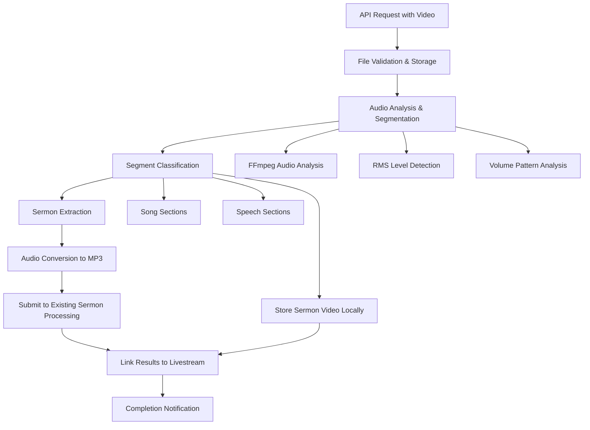

# Design Document

## Overview

The livestream video processing feature extends the existing automated sermon processing system to handle full livestream recordings. The system will automatically segment video files using audio analysis techniques (based on the existing ClipLongestQuietSection.py approach), identify sermon portions, extract both audio and video, and feed the audio into the existing automated sermon processing pipeline while storing the video locally.

This design builds upon the existing Laravel-based sermon processing infrastructure while adding video processing capabilities through FFmpeg integration and intelligent audio analysis for automatic segmentation.

## Architecture

### High-Level Flow



### Service Layer Architecture

The system extends the existing service architecture with focused services:

- **LivestreamProcessingController**: Handles API requests for video uploads
- **LivestreamProcessingService**: Orchestrates the workflow by dispatching job chains
- **VideoSegmentationService**: Contains business logic for analyzing FFmpeg output and identifying segments
- **VideoStorageService**: Manages video file storage using Laravel's Storage facade

## Components and Interfaces

### API Endpoints

#### Primary Upload Endpoint
**Route**: `POST /api/livestreams/process`

**Request Format**:
```php
Content-Type: multipart/form-data
file: Video file (required) - MP4, MOV, AVI, MKV
options: JSON object (optional) - Processing preferences
```

**Response Format**:
```json
{
    "success": true,
    "message": "Livestream processing initiated",
    "processing_id": "uuid-string",
    "status_url": "/api/livestreams/processing/{processing_id}/status",
    "estimated_completion": "2024-01-15T10:30:00Z"
}
```

#### Status Monitoring Endpoint
**Route**: `GET /api/livestreams/processing/{processingId}/status`

**Response Format**:
```json
{
    "processing_id": "uuid-string",
    "status": "segmenting",
    "current_step": "audio_analysis",
    "progress_percentage": 45,
    "segments_identified": 5,
    "sermon_processing_id": "uuid-string",
    "sermon_video_path": "/storage/sermons/2024-01-15/sermon_video.mp4",

    "segments": [
        {
            "index": 1,
            "start_time": 0.0,
            "end_time": 180.5,
            "classification": "song"
        },
        {
            "index": 2,
            "start_time": 180.5,
            "end_time": 2100.0,
            "classification": "speech",
            "is_sermon": true
        }
    ]
}
```


### Core Services

#### VideoSegmentationService

```php
class VideoSegmentationService
{
    public function processLivestream(UploadedFile $file, array $options = []): ProcessingResult
    public function getProcessingStatus(string $processingId): LivestreamProcessingStatus
    private function extractAudioTrack(string $videoPath): string
    private function analyzeAudioSegments(string $audioPath): array
    private function classifySegments(array $segments): array
    private function extractVideoSegments(string $videoPath, array $segments): array
}
```

#### LivestreamProcessingService

```php
class LivestreamProcessingService
{
    public function processLivestream(UploadedFile $file): ProcessingResult
    {
        $processingId = Str::uuid();
        
        // Store initial record
        LivestreamProcessingLog::create([
            'processing_id' => $processingId,
            'original_filename' => $file->getClientOriginalName(),
            'file_path' => Storage::putFile('livestreams', $file),
            'file_size' => $file->getSize(),
            'status' => 'pending'
        ]);
        
        // Dispatch job chain for resilient processing
        Bus::chain([
            new GenerateRmsLog($processingId),
            new AnalyzeSegments($processingId),
            new ExtractSermon($processingId),
            new SubmitToProcessing($processingId),
            new CleanupTemporaryFiles($processingId),
        ])->catch(function (Throwable $e) use ($processingId) {
            $this->handleProcessingFailure($processingId, $e);
        })->dispatch();
        
        return new ProcessingResult($processingId);
    }
    
    public function getProcessingStatus(string $processingId): array
    private function handleProcessingFailure(string $processingId, Throwable $e): void
}
```

#### VideoSegmentationService

```php
class VideoSegmentationService
{
    public function analyzeVideoSegments(string $videoPath): array
    public function findLongestSpeechSection(array $segments): ?array
    private function parseAudioSections(string $logPath): array
    private function combineLoudAndQuietSections(array $loudSections, float $totalDuration): array
}
```

#### VideoStorageService

```php
use Illuminate\Support\Facades\Storage;
use FFMpeg\FFMpeg;
use FFMpeg\Coordinate\TimeCode;
use FFMpeg\Format\Video\DefaultVideo;

class VideoStorageService
{
    public function storeSermonVideo(string $videoPath, int $sermonId): string
    {
        $sermonDirectory = "sermons/{$sermonId}";
        $filename = 'video.mp4';
        
        // Use Laravel Storage facade for storage-agnostic operations
        $storedPath = Storage::putFileAs($sermonDirectory, new File($videoPath), $filename);
        
        return $storedPath;
    }
    
    public function extractVideoSegmentWithOriginalQuality(string $inputPath, float $startTime, float $endTime): string
    {
        // Use php-ffmpeg package for cleaner FFmpeg integration
        $ffmpeg = FFMpeg::create([
            'ffmpeg.binaries' => config('livestream-processing.ffmpeg_path'),
            'ffprobe.binaries' => config('livestream-processing.ffprobe_path'),
        ]);
        
        $video = $ffmpeg->open(Storage::path($inputPath));
        
        // Extract segment preserving original quality (stream copy)
        $tempPath = storage_path('app/temp/' . Str::uuid() . '.mp4');
        
        $format = new \FFMpeg\Format\Video\DefaultVideo();
        // Add the critical '-c copy' parameter for true stream copy
        $format->setAdditionalParameters(['-c', 'copy']);
        
        $video
            ->clip(TimeCode::fromSeconds($startTime), TimeCode::fromSeconds($endTime - $startTime))
            ->save($format, $tempPath);
        
        return $tempPath;
    }
    
    public function cleanupTemporaryFiles(string $processingId): void
    {
        Storage::deleteDirectory("temp/livestreams/{$processingId}");
    }
}
```

### Data Transfer Objects

#### LivestreamSegment
```php
class LivestreamSegment
{
    public readonly float $startTime;
    public readonly float $endTime;
    public readonly float $duration;
    public readonly string $classification; // 'song', 'speech'
    public readonly float $averageRMS;
    public readonly string $extractedVideoPath;
}
```

#### LivestreamProcessingResult
```php
class LivestreamProcessingResult
{
    public readonly string $processingId;
    public readonly array $segments;
    public readonly ?LivestreamSegment $sermonSegment;
    public readonly ?string $sermonProcessingId;
    public readonly ?string $sermonVideoPath;
    public readonly string $status; // 'completed' or 'failed'
}
```

## Data Models

### Database Schema Extensions

#### New Livestream Processing Table
```sql
CREATE TABLE livestream_processing_logs (
    id BIGINT UNSIGNED PRIMARY KEY AUTO_INCREMENT,
    processing_id VARCHAR(36) UNIQUE NOT NULL,
    original_filename VARCHAR(255) NOT NULL,
    file_path VARCHAR(500) NOT NULL,
    file_size BIGINT UNSIGNED NOT NULL,
    duration_seconds INT UNSIGNED,
    status ENUM('pending', 'processing', 'completed', 'failed') NOT NULL,
    error_message TEXT NULL,
    sermon_processing_id VARCHAR(36) NULL,
    sermon_id BIGINT UNSIGNED NULL,
    created_at TIMESTAMP DEFAULT CURRENT_TIMESTAMP,
    updated_at TIMESTAMP DEFAULT CURRENT_TIMESTAMP ON UPDATE CURRENT_TIMESTAMP,
    completed_at TIMESTAMP NULL,
    FOREIGN KEY (sermon_id) REFERENCES sermons(id) ON DELETE SET NULL,
    INDEX idx_status (status),
    INDEX idx_processing_id (processing_id)
);
```

#### Livestream Segments Table
```sql
CREATE TABLE livestream_segments (
    id BIGINT UNSIGNED PRIMARY KEY AUTO_INCREMENT,
    processing_id VARCHAR(36) NOT NULL,
    segment_index TINYINT UNSIGNED NOT NULL,
    start_time DECIMAL(10,3) NOT NULL,
    end_time DECIMAL(10,3) NOT NULL,
    duration DECIMAL(10,3) NOT NULL,
    classification ENUM('song', 'speech') NOT NULL,
    is_sermon_segment BOOLEAN DEFAULT FALSE,
    created_at TIMESTAMP DEFAULT CURRENT_TIMESTAMP,
    FOREIGN KEY (processing_id) REFERENCES livestream_processing_logs(processing_id) ON DELETE CASCADE,
    INDEX idx_processing_id (processing_id),
    INDEX idx_sermon_segment (is_sermon_segment)
);
```

#### Sermon Extensions Table
```sql
ALTER TABLE sermons ADD COLUMN livestream_processing_id VARCHAR(36) NULL AFTER id;
ALTER TABLE sermons ADD COLUMN video_file_path VARCHAR(500) NULL AFTER audio_file_path;
ALTER TABLE sermons ADD COLUMN source_type ENUM('manual', 'audio_upload', 'livestream') DEFAULT 'manual' AFTER video_file_path;
ALTER TABLE sermons ADD COLUMN segment_start_time DECIMAL(10,3) NULL AFTER source_type;
ALTER TABLE sermons ADD COLUMN segment_end_time DECIMAL(10,3) NULL AFTER segment_start_time;

ALTER TABLE sermons ADD INDEX idx_livestream_processing (livestream_processing_id);
ALTER TABLE sermons ADD INDEX idx_source_type (source_type);
```

### File Storage Structure

```
storage/app/livestreams/
├── {processing_id}/
│   ├── original.mp4              # Original uploaded video
│   ├── audio_extract.wav         # Extracted audio for analysis
│   ├── rms_analysis.log          # FFmpeg RMS analysis output
│   ├── segments/
│   │   ├── segment_001_song.mp4      # Extracted video segments
│   │   ├── segment_002_speech.mp4
│   │   ├── segment_003_sermon.mp4    # Sermon video segment
│   │   └── segment_003_sermon.mp3    # Sermon audio for processing
│   ├── processing_report.json    # Comprehensive processing report
│   └── metadata.json             # Processing metadata and results

storage/app/sermons/
├── {sermon_id}/
│   ├── audio.mp3                 # Processed sermon audio
│   ├── video.mp4                 # Sermon video (from livestream)
│   ├── transcript.txt            # AI-generated transcript
│   └── metadata.json             # Sermon metadata including livestream source
```

## Audio Analysis Implementation

### FFmpeg Integration

The system will use FFmpeg for audio analysis, closely following the logic from ClipLongestQuietSection.py:

#### RMS Level Analysis with Accurate Timing
```php
private function generateRMSLog(string $videoPath): string
{
    $logPath = Storage::path("temp/rms_" . Str::uuid() . ".log");
    
    // Include pts_time for accurate timestamps instead of calculating frame duration
    $command = [
        config('livestream-processing.ffmpeg_path'),
        '-i', Storage::path($videoPath),
        '-af', "astats=metadata=1:reset=1,ametadata=print:key=lavfi.astats.Overall.RMS_level:key=frame.pts_time:file={$logPath}",
        '-f', 'null',
        '-'
    ];
    
    $process = new Process($command);
    $process->setTimeout(7200); // 2 hour timeout for large files
    $process->run();
    
    if (!$process->isSuccessful()) {
        throw new ProcessFailedException($process);
    }
    
    return $logPath;
}
```

#### Segment Identification with Accurate Timing
```php
private function parseAudioSections(string $logPath, float $threshold = -30.0, float $minSectionDuration = 60.0): array
{
    $lines = file($logPath, FILE_IGNORE_NEW_LINES);
    $sections = [];
    $currentSection = null;
    
    foreach ($lines as $line) {
        // Parse both RMS level and accurate timestamp from FFmpeg output
        if (preg_match('/frame\.pts_time=(\d+\.\d+).*lavfi\.astats\.Overall\.RMS_level=(-?\d+\.\d+)/', $line, $matches)) {
            $time = (float) $matches[1]; // Use actual pts_time instead of calculated duration
            $rmsLevel = (float) $matches[2];
            
            if ($rmsLevel > $threshold) {
                // Start a new loud section if none is active
                if ($currentSection === null) {
                    $currentSection = ['start' => $time, 'end' => null];
                }
            } else {
                // End the current loud section if active
                if ($currentSection !== null) {
                    $currentSection['end'] = $time;
                    // Only add the section if it meets the minimum duration
                    if (($currentSection['end'] - $currentSection['start']) >= $minSectionDuration) {
                        $sections[] = $currentSection;
                    }
                    $currentSection = null;
                }
            }
        }
    }
    
    // Close any open section at end of file
    if ($currentSection !== null && isset($time)) {
        $currentSection['end'] = $time;
        if (($currentSection['end'] - $currentSection['start']) >= $minSectionDuration) {
            $sections[] = $currentSection;
        }
    }
    
    return $sections;
}

private function combineLoudAndQuietSections(array $loudSections, float $totalDuration): array
{
    $combinedSections = [];
    $previousEnd = 0.0;
    
    foreach ($loudSections as $section) {
        $start = $section['start'];
        $end = $section['end'];
        
        // Add quiet section before the current loud section
        if ($start > $previousEnd) {
            $combinedSections[] = [
                'start' => $previousEnd,
                'end' => $start,
                'classification' => 'speech'
            ];
        }
        
        // Add the current loud section
        $combinedSections[] = [
            'start' => $start,
            'end' => $end,
            'classification' => 'song'
        ];
        
        $previousEnd = $end;
    }
    
    // Add the final quiet section if it exists
    if ($previousEnd < $totalDuration) {
        $combinedSections[] = [
            'start' => $previousEnd,
            'end' => $totalDuration,
            'classification' => 'speech'
        ];
    }
    
    return $combinedSections;
}
```

### Configuration Options

```php
// config/livestream-processing.php
return [
    'rms_threshold' => env('LIVESTREAM_RMS_THRESHOLD', -30.0), // Sections above this are "song", below are "speech"
    'min_section_duration' => env('LIVESTREAM_MIN_SECTION_DURATION', 60.0),
    'min_sermon_duration' => env('LIVESTREAM_MIN_SERMON_DURATION', 300.0), // 5 minutes minimum for sermon
    'ffmpeg_path' => env('FFMPEG_PATH', '/usr/bin/ffmpeg'),
    'ffprobe_path' => env('FFPROBE_PATH', '/usr/bin/ffprobe'),
    'max_file_size' => env('LIVESTREAM_MAX_FILE_SIZE', 2147483648), // 2GB
    'supported_formats' => ['mp4', 'mov', 'avi', 'mkv'],
    'admin_email' => env('LIVESTREAM_ADMIN_EMAIL', config('app.admin_email')),
    'storage_disk' => env('LIVESTREAM_STORAGE_DISK', 'local'), // Can be 'local', 's3', etc.
    'sermon_disk' => env('LIVESTREAM_SERMON_DISK', 'sermon_disk'), // Disk for storing sermon videos
];
```

### Required Composer Packages

```json
{
    "require": {
        "php-ffmpeg/php-ffmpeg": "^1.0",
        "league/flysystem-aws-s3-v3": "^3.0"
    }
}
```

## Queue Integration

### Job Chain Structure

```php
// Job chain for resilient processing
Bus::chain([
    new GenerateRmsLog($processingId),
    new AnalyzeSegments($processingId),
    new ExtractSermon($processingId),
    new SubmitToProcessing($processingId),
    new CleanupTemporaryFiles($processingId),
])->catch(function (Throwable $e) use ($processingId) {
    LivestreamProcessingLog::where('processing_id', $processingId)
        ->update([
            'status' => 'failed',
            'error_message' => $e->getMessage(),
        ]);
    
    // Send email notification to administrators
    Mail::to(config('livestream-processing.admin_email'))
        ->send(new LivestreamProcessingFailed($processingId, $e->getMessage()));
})->dispatch();
```

### Job Chain Classes

- **GenerateRmsLog**: 
  - Validates video file format and size
  - Generates RMS log using FFmpeg with accurate pts_time timestamps
  - Updates status to 'processing'

- **AnalyzeSegments**: 
  - Parses RMS log following ClipLongestQuietSection.py logic
  - Identifies segments and stores in database
  - Finds longest speech section as sermon candidate

- **ExtractSermon**: 
  - Extracts sermon video segment preserving original quality using php-ffmpeg
  - Converts audio to MP3 for sermon processing
  - Uses Laravel Storage facade for file operations

- **SubmitToProcessing**: 
  - Submits sermon audio to existing processing pipeline
  - Stores video with sermon metadata
  - Updates status to completed or failed

- **CleanupTemporaryFiles**: 
  - Cleans up temporary files and processing directories
  - Ensures reliable cleanup after both successful and failed processing
  - Removes RMS logs, extracted audio, and temporary video segments

## Sermon Processing Integration

### Metadata Extraction and Storage

The system integrates with the existing automated sermon processing pipeline to extract and utilize metadata for video storage:

#### Sermon Metadata Integration

```php
class SermonMetadataIntegrationService
{
    public function linkVideoToSermon(string $processingId, int $sermonId): void
    {
        $processing = LivestreamProcessingLog::findByProcessingId($processingId);
        $sermon = Sermon::find($sermonId);
        
        // Update sermon record with video information
        $sermon->update([
            'livestream_processing_id' => $processingId,
            'video_file_path' => $this->getSermonVideoPath($processingId),
            'source_type' => 'livestream',
            'segment_start_time' => $this->getSermonSegmentStartTime($processingId),
            'segment_end_time' => $this->getSermonSegmentEndTime($processingId),
        ]);
        
        // Update processing log with sermon link
        $processing->update(['sermon_id' => $sermonId]);
    }
    
    public function storeVideoWithMetadata(string $processingId, array $sermonMetadata): string
    {
        $sermonId = $sermonMetadata['sermon_id'];
        $videoPath = $this->extractSermonVideo($processingId);
        
        // Use metadata from automated sermon processing
        $finalVideoPath = $this->organizeVideoFile($videoPath, [
            'sermon_id' => $sermonId,
            'title' => $sermonMetadata['title'] ?? 'Untitled Sermon',
            'preacher' => $sermonMetadata['preacher'] ?? 'Unknown',
            'date' => $sermonMetadata['date'] ?? now(),
            'series' => $sermonMetadata['series'] ?? null,
        ]);
        
        return $finalVideoPath;
    }
    
    private function organizeVideoFile(string $videoPath, array $metadata): string
    {
        // Use Storage facade for storage-agnostic operations
        $sermonDisk = Storage::disk('sermon_disk');
        
        $directory = "{$metadata['sermon_id']}";
        $filename = 'video.mp4';
        $finalPath = "{$directory}/{$filename}";
        
        // Use Storage::putFileAs to copy the file from its local temp path to the final disk
        $sermonDisk->putFileAs($directory, new \Illuminate\Http\File($videoPath), $filename);
        
        // Store metadata alongside video on the same disk
        $sermonDisk->put(
            "{$directory}/metadata.json",
            json_encode($metadata, JSON_PRETTY_PRINT)
        );
        
        return $finalPath; // This is now a relative path on the target disk
    }
}
```


#### Video Storage with Sermon Context

The system stores sermon videos using the metadata extracted by the automated sermon processing:

1. **Original Quality Preservation**: Always maintains original video resolution, bitrate, and codec without re-encoding
2. **Title and Preacher Information**: Uses AI-extracted sermon title and preacher name for file organization
3. **Series Information**: Links video to sermon series if identified
4. **Date and Time**: Uses service date for proper chronological organization
5. **Bible References**: Stores extracted Bible passage references with the video
6. **Transcript Integration**: Links video timestamps to transcript sections
7. **Single Sermon Limitation**: Only the longest speech segment is extracted as the primary sermon

#### Administrative Interface Enhancement

```php
class SermonVideoDisplayService
{
    public function getSermonWithVideo(int $sermonId): array
    {
        $sermon = Sermon::with('livestreamProcessing.segments')->find($sermonId);
        
        return [
            'sermon' => $sermon,
            'has_video' => !empty($sermon->video_file_path),
            'video_url' => $sermon->video_file_path ? $this->getVideoUrl($sermon->video_file_path) : null,
            'source_type' => $sermon->source_type,
            'livestream_info' => $sermon->livestreamProcessing ? [
                'original_filename' => $sermon->livestreamProcessing->original_filename,
                'processing_date' => $sermon->livestreamProcessing->created_at,
                'segment_start' => $sermon->segment_start_time,
                'segment_end' => $sermon->segment_end_time,
                'total_segments' => $sermon->livestreamProcessing->segments->count(),
            ] : null,
        ];
    }
    
    public function getVideoPreviewData(int $sermonId): array
    {
        $sermon = Sermon::find($sermonId);
        
        if (!$sermon->video_file_path) {
            return ['has_video' => false];
        }
        
        return [
            'has_video' => true,
            'video_url' => $this->getVideoUrl($sermon->video_file_path),
            'duration' => $this->getVideoDuration($sermon->video_file_path),
            'file_size' => filesize($sermon->video_file_path),
            'format' => pathinfo($sermon->video_file_path, PATHINFO_EXTENSION),
        ];
    }
}
```


## Error Handling

### Processing Pipeline Error Handling

1. **File Validation Errors**: Invalid format, corrupted files, size limits
2. **FFmpeg Processing Errors**: Command failures, codec issues, insufficient disk space
3. **Segmentation Errors**: No clear segments found, all segments too short
4. **No Sermon Found Errors**: No speech segments identified (only song segments found), or longest speech segment shorter than minimum sermon duration
4. **Video Storage Errors**: Disk space issues, file permission problems
5. **Integration Errors**: Sermon processing API failures, database constraints

### Recovery Strategies

- **Partial Success Handling**: Continue processing even if some segments fail
- **Graceful Degradation**: Manual segment review when automatic classification fails
- **Retry Logic**: Exponential backoff for transient failures with configurable retry attempts
- **Manual Override**: Administrator interface for correcting segmentation boundaries and classifications
- **Fallback Processing**: Direct sermon processing if segmentation fails completely
- **Configuration Validation**: Validate all configuration changes and provide feedback on invalid values
- **Storage Error Handling**: Handle disk space and file permission errors with appropriate user feedback


## Testing Strategy

### Unit Testing

- **Audio Analysis Tests**: Test RMS parsing with various audio patterns
- **Segmentation Logic Tests**: Verify segment identification accuracy
- **FFmpeg Integration Tests**: Mock FFmpeg commands and test error handling
- **Video Storage Tests**: Test local video file storage and organization
- **Configuration Tests**: Validate configuration parsing and defaults

### Integration Testing

- **End-to-End Processing Tests**: Full pipeline with sample video files of varying complexity
- **Sermon Processing Integration**: Verify handoff to existing sermon API with proper metadata extraction and usage
- **File Storage Tests**: Ensure proper file handling, organization, and cleanup with sermon metadata integration
- **Database Integration Tests**: Verify correct record creation, relationships, and sermon linking
- **Administrative Interface Tests**: Test manual review workflow and segment adjustment functionality
- **Configuration Management Tests**: Verify configuration validation and persistence

### Performance Testing

- **Large File Processing**: Test with multi-hour livestream recordings
- **Concurrent Processing**: Multiple simultaneous video uploads
- **Memory Usage Monitoring**: Ensure efficient memory usage during processing
- **Storage Space Management**: Test disk space handling and cleanup

### Test Data Requirements

- **Sample Video Files**: Various lengths, formats, and audio patterns including typical church service recordings
- **Mock RMS Data**: Simulated audio analysis results for testing different segmentation scenarios
- **Edge Case Videos**: Silent sections, constant noise, format variations, and unclear segment boundaries
- **Storage Test Scenarios**: Different disk space conditions, file permissions, and retention policy scenarios
- **Configuration Test Data**: Valid and invalid configuration combinations for testing validation
- **Manual Review Scenarios**: Test cases requiring manual intervention with various confidence levels
- **Sermon Metadata Test Data**: Mock sermon processing results for testing video storage integration

## Security Considerations

### File Upload Security

- **File Type Validation**: Strict validation of video file formats
- **File Size Limits**: Configurable maximum file sizes (default 2GB)
- **Virus Scanning**: Optional integration with antivirus scanning
- **Secure Storage**: Videos stored outside web root with restricted access

### API Security

- **Authentication**: Token-based authentication for API access
- **Rate Limiting**: Prevent abuse with configurable request limits
- **Input Validation**: Comprehensive validation of all inputs
- **Processing Limits**: Prevent resource exhaustion with processing quotas

### External Service Security

- **API Key Management**: Secure storage of external service credentials
- **Network Security**: HTTPS for all external API communications
- **Data Privacy**: Configurable data retention and deletion policies

## Monitoring and Health Checks

### Custom Health Checks

```php
// Custom health checks for livestream processing
Health::checks([
    FFmpegHealthCheck::new()->name('ffmpeg-availability'),
    LivestreamQueueHealthCheck::new()->name('livestream-queue'),
    StorageSpaceHealthCheck::new()->name('video-storage'),
]);
```

### Comprehensive Logging

The system implements detailed logging for all processing steps:

```php
class LivestreamProcessingLogger
{
    public function logProcessingStep(string $processingId, string $step, array $context = []): void
    {
        Log::info("Livestream processing step: {$step}", [
            'processing_id' => $processingId,
            'step' => $step,
            'timestamp' => now(),
            'memory_usage' => memory_get_usage(true),
            'context' => $context,
        ]);
    }
    
    public function logError(string $processingId, string $step, Throwable $exception): void
    {
        Log::error("Livestream processing error in step: {$step}", [
            'processing_id' => $processingId,
            'step' => $step,
            'error_message' => $exception->getMessage(),
            'stack_trace' => $exception->getTraceAsString(),
            'file' => $exception->getFile(),
            'line' => $exception->getLine(),
            'timestamp' => now(),
        ]);
    }
    
    public function generateProcessingReport(string $processingId): ProcessingReport
    {
        $processing = LivestreamProcessingLog::with('segments')->findByProcessingId($processingId);
        $logs = $this->getProcessingLogs($processingId);
        
        return new ProcessingReport([
            'processing_id' => $processingId,
            'total_segments' => $processing->segments->count(),
            'processing_duration' => $processing->completed_at?->diffInSeconds($processing->created_at),
            'segment_summary' => $this->generateSegmentSummary($processing->segments),
            'sermon_processing_status' => $processing->sermon_processing_id ? 'completed' : 'not_started',
            'errors' => $logs->where('level', 'error')->toArray(),
            'warnings' => $logs->where('level', 'warning')->toArray(),
        ]);
    }
}
```

### Monitoring Metrics

- **Processing Success Rate**: Percentage of successful video processing with breakdown by failure type
- **Average Processing Time**: Time from upload to completion, segmented by video duration
- **Segmentation Accuracy**: Manual review statistics and confidence score distributions
- **Sermon Processing Success**: Success rate of sermon processing pipeline integration
- **Storage Usage**: Disk space utilization for video files with retention policy effectiveness
- **Queue Health**: Processing queue depth, worker status, and job failure rates
- **Manual Review Rate**: Percentage of processing requiring manual intervention

### Alerting and Notifications

- **Failed Processing**: Alert on processing failures requiring manual intervention with detailed error context
- **Storage Warnings**: Alert when storage space is running low with cleanup recommendations
- **Performance Degradation**: Alert on unusually long processing times with system resource analysis
- **Manual Review Required**: Notify administrators when processing requires manual review
- **Configuration Issues**: Alert on invalid configuration changes with validation feedback