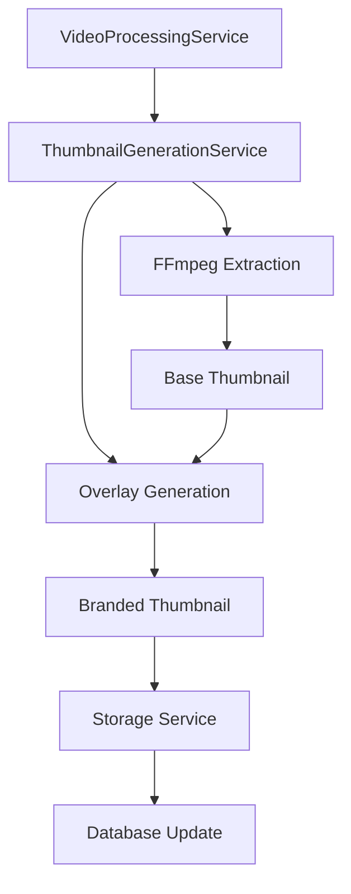

# Design Document

## Overview

This design document outlines the implementation of automated thumbnail generation for sermon videos within the existing media processing architecture. The system will generate thumbnails with branded overlays that include sermon metadata, integrating seamlessly with the current VideoProcessingService and ProcessingStatusContract infrastructure.

## Architecture

### Integration Points

The thumbnail generation system integrates with the existing architecture at these key points:

1. **VideoProcessingService**: Add thumbnail generation after video processing completion
2. **ProcessingStatusContract**: Include thumbnail generation status in unified processing responses
3. **Sermon Model**: Extend with thumbnail-related fields and methods
4. **API Endpoints**: Enhance existing endpoints with thumbnail URLs

### Service Architecture



## Components and Interfaces

### ThumbnailGenerationService

**Location**: `app/Services/ThumbnailGenerationService.php`

**Core Responsibilities**:
- Extract thumbnail frames from video files using FFmpeg
- Generate branded overlays with sermon metadata
- Handle multiple thumbnail sizes (web and mobile)
- Integrate with existing storage patterns
- Provide error handling and fallback mechanisms

**Key Methods**:
```php
public function generateThumbnail(Sermon $sermon, string $videoPath): ThumbnailResult
public function extractBaseFrame(string $videoPath, float $duration): string
public function createOverlay(Sermon $sermon, string $baseImagePath): string
public function storeThumbnail(string $imagePath, string $sermonId): array
public function regenerateThumbnail(Sermon $sermon): ThumbnailResult
```

### ThumbnailResult Data Object

**Location**: `app/Data/ThumbnailResult.php`

Following Spatie Laravel Data patterns used throughout the codebase:

```php
use Spatie\LaravelData\Data;

class ThumbnailResult extends Data
{
    public function __construct(
        public readonly bool $success,
        public readonly ?string $thumbnailPath = null,
        public readonly ?string $errorMessage = null,
        public readonly array $metadata = []
    ) {}

    public static function success(string $thumbnailPath, array $metadata = []): self
    {
        return new self(
            success: true,
            thumbnailPath: $thumbnailPath,
            metadata: $metadata
        );
    }

    public static function skipped(string $reason): self
    {
        return new self(
            success: false,
            errorMessage: $reason
        );
    }
}
```

### Integration with VideoProcessingService

Following the existing job chain pattern used in the codebase:

**Enhanced Methods**:
- `processDirectly()`: Dispatch thumbnail job after sermon creation
- `processWithSegmentation()`: Add thumbnail job to existing job chain
- No changes to status tracking - thumbnails are background-only

**Job Chain Integration**:
```php
// In VideoProcessingService::processWithSegmentation()
Bus::chain([
    new GenerateRmsLog($processingLog),
    new AnalyzeSegments($processingLog),
    new ExtractSermon($processingLog),
    new SubmitToProcessing($processingLog),
    new GenerateThumbnail($sermonId, $videoPath), // Add here
    new CleanupTemporaryFiles($processingLog),
])->dispatch();

// In VideoProcessingService::processDirectly()
// Dispatch thumbnail job after sermon creation (not in chain)
GenerateThumbnail::dispatch($sermonId, $videoPath)
    ->onQueue('thumbnails'); // Separate queue for non-critical work
```

## Data Models

### Sermon Model Extensions

**New Database Fields**:
```php
// Migration: add_thumbnail_fields_to_sermons_table
$table->string('thumbnail_path')->nullable();
$table->timestamp('thumbnail_generated_at')->nullable();
$table->json('thumbnail_metadata')->nullable();
```

**New Model Methods** (following existing patterns):
```php
// Accessor for thumbnail URL (following existing getAudioUrlAttribute pattern)
public function getThumbnailUrlAttribute(): ?string
{
    if (!$this->thumbnail_path) {
        return null;
    }
    
    return Storage::disk('public')->url($this->thumbnail_path);
}

// Check if thumbnail exists (following existing hasTranscript pattern)
public function hasThumbnail(): bool
{
    return !empty($this->thumbnail_path) && 
           Storage::disk('public')->exists($this->thumbnail_path);
}

// Scope for sermons with thumbnails (following existing scope patterns)
public function scopeWithThumbnail(Builder $query): Builder
{
    return $query->whereNotNull('thumbnail_path');
}
```

### Thumbnail Configuration

**Location**: `config/thumbnail-generation.php`

```php
return [
    'enabled' => env('THUMBNAIL_GENERATION_ENABLED', true),
    'storage' => [
        'disk' => env('THUMBNAIL_STORAGE_DISK', 'public'),
        'path' => 'sermons/thumbnails',
    ],
    'extraction' => [
        'start_offset' => 60, // seconds
        'end_buffer' => 60,   // seconds from end to avoid
        'fallback_position' => 0.5, // midpoint for short videos
    ],
    'sizes' => [
        'web' => ['width' => 1280, 'height' => 720],
        'mobile' => ['width' => 640, 'height' => 360],
    ],
    'overlay' => [
        'brand_image' => 'images/BrandOverlay.png',
        'font' => [
            'family' => 'Oswald',
            'title_size' => 48,
            'date_size' => 32,
            'color' => '#000000',
        ],
        'background' => [
            'color' => '#FFFFFF',
            'opacity' => 0.8,
        ],
    ],
    'fallback' => [
        'default_image' => 'images/default-sermon-thumbnail.jpg',
        'retry_attempts' => 3,
    ],
];
```

## Error Handling

### Graceful Degradation Strategy

Following the existing architecture pattern of non-blocking processing:

1. **FFmpeg Unavailable**: Skip thumbnail generation, log warning, continue processing
2. **Video File Corrupted**: Skip thumbnail generation, log error, continue processing  
3. **Overlay Generation Fails**: Skip thumbnail generation, log error, continue processing
4. **Storage Fails**: Skip thumbnail generation, log error, continue processing
5. **Any Thumbnail Error**: Never block the main processing pipeline

### Error Recovery

```php
class ThumbnailGenerationService
{
    public function generateThumbnail(Sermon $sermon, string $videoPath): ThumbnailResult
    {
        try {
            // Attempt thumbnail generation
            return $this->performThumbnailGeneration($sermon, $videoPath);
        } catch (\Exception $e) {
            // Log error but don't throw - never block processing
            Log::warning('Thumbnail generation failed, skipping', [
                'sermon_id' => $sermon->id,
                'error' => $e->getMessage(),
            ]);

            return ThumbnailResult::skipped($e->getMessage());
        }
    }
}
```

### Job-Based Processing

Following existing patterns, thumbnail generation will use Laravel Jobs:

```php
class GenerateThumbnail implements ShouldQueue
{
    use Queueable, SerializesModels;

    public int $tries = 1; // Single attempt - don't retry thumbnail failures
    public int $timeout = 300; // 5 minute timeout

    public function __construct(
        private int $sermonId,
        private string $videoPath
    ) {}

    public function handle(ThumbnailGenerationService $service): void
    {
        $sermon = Sermon::find($this->sermonId);
        if (!$sermon) {
            Log::warning('Sermon not found for thumbnail generation', ['sermon_id' => $this->sermonId]);
            return;
        }

        $result = $service->generateThumbnail($sermon, $this->videoPath);
        
        if ($result->success) {
            $sermon->update([
                'thumbnail_path' => $result->thumbnailPath,
                'thumbnail_generated_at' => now(),
                'thumbnail_metadata' => $result->metadata,
            ]);
        }
        
        // Never throw exceptions - thumbnail failures should not affect processing
    }

    public function failed(\Throwable $exception): void
    {
        Log::warning('Thumbnail generation job failed', [
            'sermon_id' => $this->sermonId,
            'error' => $exception->getMessage(),
        ]);
        // Don't mark processing as failed - thumbnails are optional
    }
}
```

## Testing Strategy

### Unit Tests

**ThumbnailGenerationServiceTest**:
- Test frame extraction with various video durations
- Test overlay generation with different sermon metadata
- Test error handling scenarios
- Test storage operations

**SermonModelTest**:
- Test new thumbnail-related methods
- Test thumbnail URL generation
- Test metadata handling

### Integration Tests

**VideoProcessingIntegrationTest**:
- Test thumbnail generation in full processing pipeline
- Test status tracking with thumbnail steps
- Test error scenarios don't break processing

### Feature Tests

**ThumbnailApiTest**:
- Test thumbnail URLs in sermon API responses
- Test thumbnail regeneration endpoint
- Test caching headers

## Performance Considerations

### Laravel Best Practices Implementation

Following existing codebase patterns for optimal performance:

1. **Queue Separation**: Use dedicated 'thumbnails' queue for non-critical work
2. **Single Attempt**: Don't retry failed thumbnail jobs (tries = 1)
3. **Reasonable Timeout**: 5-minute timeout for image processing
4. **Storage Optimization**: Use public disk for direct CDN access
5. **Dependency Injection**: Proper service container usage

### Resource Management

```php
class ThumbnailGenerationService
{
    public function __construct(
        private readonly VideoSegmentationService $videoService
    ) {
        // Use existing FFmpeg configuration from VideoSegmentationService
        // Leverage existing patterns for resource management
    }

    private function extractFrame(string $videoPath, float $timestamp): string
    {
        // Reuse existing FFmpeg setup from VideoSegmentationService
        // Follow existing temporary file patterns
        // Use existing cleanup mechanisms
    }
}
```

### Configuration Management

Following existing config patterns:
```php
// config/thumbnail-generation.php (following existing config structure)
return [
    'enabled' => env('THUMBNAIL_GENERATION_ENABLED', true),
    'queue' => env('THUMBNAIL_QUEUE', 'thumbnails'),
    'timeout' => env('THUMBNAIL_TIMEOUT', 300),
    'storage' => [
        'disk' => env('THUMBNAIL_STORAGE_DISK', 'public'),
        'path' => 'sermons/thumbnails',
    ],
    // ... rest of config
];
```

## Implementation Phases

### Phase 1: Core Service Implementation

**Tasks**:
1. Create ThumbnailGenerationService with FFmpeg integration
2. Implement basic frame extraction logic
3. Add database migration for thumbnail fields
4. Create ThumbnailResult data object

**Acceptance Criteria**:
- Service can extract frames from video files
- Database schema supports thumbnail storage
- Basic error handling is implemented

### Phase 2: Overlay System

**Tasks**:
1. Implement overlay generation using Imagick/GD
2. Create branded overlay templates
3. Add responsive text sizing logic
4. Implement multiple thumbnail sizes

**Acceptance Criteria**:
- Thumbnails include sermon title and date
- Church branding is properly positioned
- Text is readable and accessible
- Multiple sizes are generated

### Phase 3: Pipeline Integration

**Tasks**:
1. Integrate with VideoProcessingService
2. Update ProcessingStatusContract responses
3. Add thumbnail generation to status tracking
4. Implement background processing

**Acceptance Criteria**:
- Thumbnails generated during video processing
- Status updates include thumbnail progress
- Processing doesn't fail if thumbnails fail
- Thumbnails generated asynchronously

### Phase 4: API and Frontend

**Tasks**:
1. Add thumbnail URLs to sermon API responses
2. Create thumbnail regeneration endpoint
3. Update Sermon model with thumbnail methods
4. Add Open Graph meta tags

**Acceptance Criteria**:
- API responses include thumbnail URLs
- Admins can regenerate thumbnails
- Social media sharing uses thumbnails
- Proper HTTP caching implemented

## Performance Considerations

### Optimization Strategies

1. **Asynchronous Processing**: Generate thumbnails in background queues
2. **Caching**: Cache thumbnail URLs to reduce database queries
3. **CDN Ready**: Store thumbnails in public disk for CDN integration
4. **Lazy Loading**: Generate thumbnails only when first requested (optional)

### Resource Management

```php
class ThumbnailGenerationService
{
    private function optimizeForPerformance(): void
    {
        // Set memory limit for image processing
        ini_set('memory_limit', '512M');
        
        // Use temporary files to avoid memory issues
        $this->useTempFiles = true;
        
        // Cleanup temporary files after processing
        register_shutdown_function([$this, 'cleanupTempFiles']);
    }
}
```

### Monitoring

- Track thumbnail generation success/failure rates
- Monitor processing time for thumbnail generation
- Alert on repeated failures
- Track storage usage for thumbnail files

## Security Considerations

1. **File Validation**: Validate video files before processing
2. **Path Sanitization**: Sanitize file paths to prevent directory traversal
3. **Resource Limits**: Limit processing time and memory usage
4. **Access Control**: Restrict thumbnail regeneration to admin users
5. **Storage Security**: Use secure storage configurations

## Backwards Compatibility

The implementation maintains full backwards compatibility:

1. **Existing Sermons**: Thumbnails are optional, existing sermons continue to work
2. **API Responses**: Thumbnail URLs are added as optional fields
3. **Processing Pipeline**: Thumbnail generation doesn't affect existing processing
4. **Database**: New fields are nullable, existing data is preserved

## Future Enhancements

1. **Multiple Thumbnail Sizes**: Support for various social media formats
2. **Custom Overlays**: Allow custom overlay templates per series
3. **Video Previews**: Generate short preview clips alongside thumbnails
4. **Chapter Thumbnails**: Generate thumbnails for sermon chapters/sections
5. **AI-Generated Thumbnails**: Use AI to select optimal frames based on content